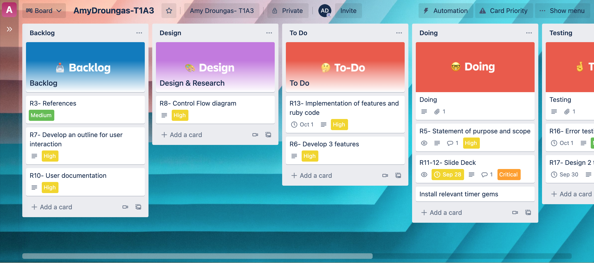

# T1A3-Terminal-Application
## Software Development Plan 

#### R4 GitHub Repository 

https://github.com/droucode/T1A3-Terminal-Application- 

#### R5: Develop a statement of purpose and scope for your application. It must include:
##### describe at a high level what the application will do
My terminal application will serve as productivity buddy, for the user. The purose of the application is to encourage positive work habits and create an en enviroment where that is possible.

The MVP for Crunch-Time is as follows: 

- 1. The user has the option to run two programs: "Energy" and "Mindfulness", which are run on a timer. The routines are created to serve different user needs.
- 2. Alarm 
- 3. usermanual.txt 
- 4. Responsive menu

#### identify the problem it will solve and explain why you are developing it
##### The problem that will be addressed through this application: 

Working productively is an life essential skill to develop apon. Often when you’re working on a solution or studying for long perid of time, work begins to lose focus and distractions begin to infiltrate workflow. Problems and outcomes are listed below: 
 
- 1. Decrease distractions: By optimising focus and concentration. Both routines are designed to enourage the user to connect with their body, clear their mind and discover the intention of their task. 

- 2. Reduce workload anxiety and stress: By working efficiently and slowly completing tasks with purpose, the individual doesnt lose sight of the task being achievable. 

- 3. Promote healthy habits: Exercising and practcing mindfulness are important components to a healthy and balanced lifestyle. 

- 4. Identify the target audience:
The target audience will be anybody with a task. Students working on project/ teams managing group assignment/ work tasks. The applicaton has a large footprint, for a variety of users across different industries and purposes. 

##### explain how a member of the target audience will use it
Example Target Audience: Group assignment, it's important to remember that everybody works diferently; Each team member will select their prefered program "Energy"/"Mindfulness" or both and run the routine. Once everybody has reflected and aquired their focus and intention, colaboration and begin. Each person sets their alarm and the team begins work. Once the timer has elsapsed, the users will be ecncouraged to relfect on their structured time. What went well? what could be done better? The application can be run whenever the team or individuals what to complete work. 

#### R6	Develop a list of features that will be included in the application. It must include:
- At least THREE features
- Menu 
- Energy Routine
- Mindfulness Routine
- usermanual.txt
- Alarm 

- Describe each feature
Menu.rb: The application begins with a while loop, which greets the user stores their name, which it iterated. The main menu follows and is first point of naviagtion for the user and is responisble for the control flow of the application. The menu is build using the TTY-Prompt gem and is enclosed within a while loop and case for command line statements that help the user navigate through the application. 

as you can see above, if the user does not enter their name after the second rotation of the loop, the loop breaks and the application will assign the user a preset name of "Al Jr." 

Energy.rb: This file is where the code for the energy routine is stored within an Energy Class. Within class the variables are initialsed, which allows the code to DRY when calling the routine steps witin the timers.The timers are stored in a separate method. This file is relative_require in main.rb and the classes are called in order for the program to run. 

Mindfulness: the same logic as above applied to the mindfuness routine; differnt variables and routine. 

usermaual.txt file: this is a read only file that is displayed to the user, when the menu choice is selected.the file is stored within its own method. 

Alarm: The user is reqired to enter and "Hour" and "Minute" to set their clock. Each vaiable is converted to an integer. Using the date gem, the current date is set for the alarm to take affect and a conditional control structur is set to accept 12h hour. Then a while loop is incorporated to run the alarm sound. It is set to rotate once and then prompts the user back to the main menu- from where they can quit the application. 

Note: Ensure that your features above allow you to demonstrate your understanding of the following language elements and concepts:
- use of variables and the concept of variable scope
- loops and conditional control structures
- error handling

#### R7	Develop an outline of the user interaction and experience for the application.
Your outline must include:
- how the user will find out how to interact with / use each feature
1. The user is greeted with a welcome messagae and prompted to enter their name.
2. Then they are prompted to select a menu choice 
3. The user is directed through prompts on each page to guide them through the application. 
4. The user can select the usermanual menu choice and a .txt file will display how to use the application. 

- how the user will interact with / use each feature
The user can easily navigate the menu through TTY-prompt menu.choice functionality. 

The Energy and Mindfulness Routines are set on timers and the user will complete the program by following the instructions. once the program has ended, the user will be directed back to the main menu. 

The user will be able to follow the directions of the application and enter their desired time. When the time condition has been satisfied, the alarm sounds  - prompting the user back to the main menu. 

- how errors will be handled by the application and displayed to the user
errors are handled by conditional control structures, whereby of the user input is incorrect- they are prompted to try again. 

#### R8	Develop a diagram which describes the control flow of your application. Your diagram must:
- show the workflow/logic and/or integration of the features in your application for each feature.

#### R9 Project Management 

I utilised trello to manage the build of my terminal application. I installed a power-up "Card Priorty" which allowed be to manage my tasks in further detail. I found using the check-list function very useful in keeping track of my tasks. 

#### R10 Design help documentation which includes a set of instructions which accurately describe how to use and install the application.

You must include:
- steps to install the application
To run the application, you will require to have ruby installed on you machine. Directions can be found here 
[ruby_install_link](https://www.ruby-lang.org/en/downloads)

When you have ruby up, you will need to insall the following gems to run the application 
you can do this through your terminal 

clone this repository 

here you will copy the SSH link and into your terminal "git clone" and paste the link. You can open the zip file in a text editor or simply run it through your terminal. 

runing the application 

open your terminal 
change into the directory which contains the repository 
cd AmyDroungas_T1A3
run the applictaion 
ruby menu.rb 

#### R17	Design TWO tests which check that the application is running as expected.

#### ToolBox 

1. Git Hub 
2. Visual Studio Code
3. Trello 
4. Git 
5. Ruby 
6. Ruby Gems 